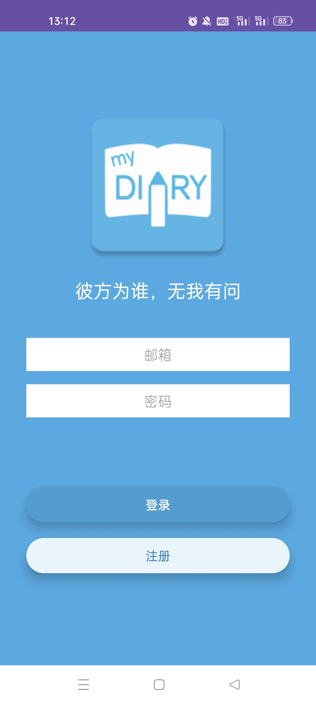
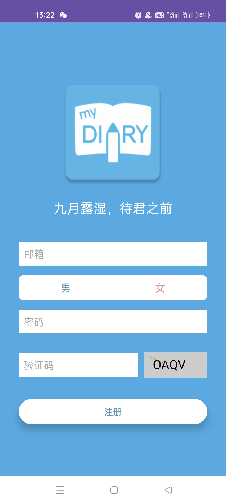
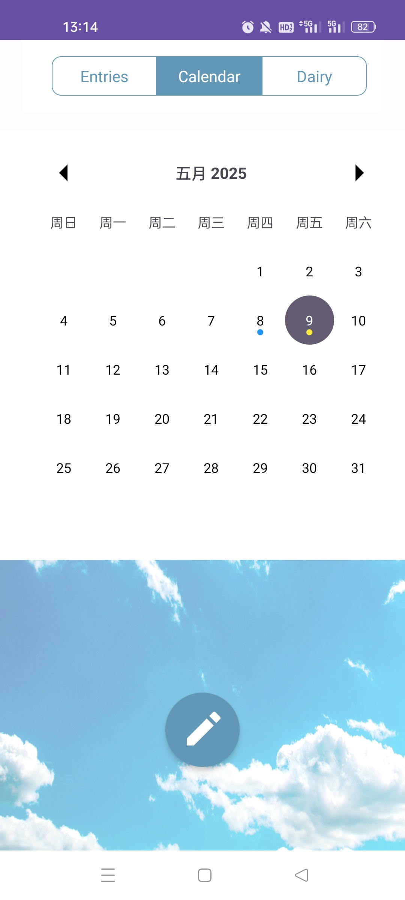
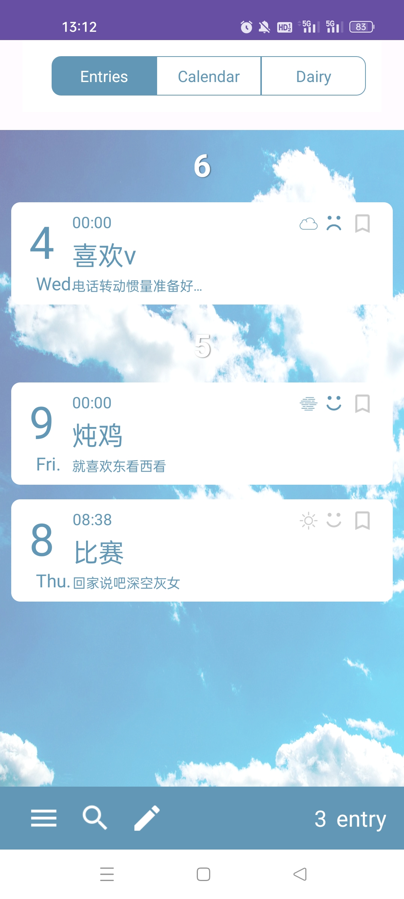
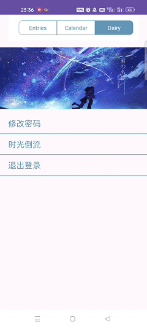
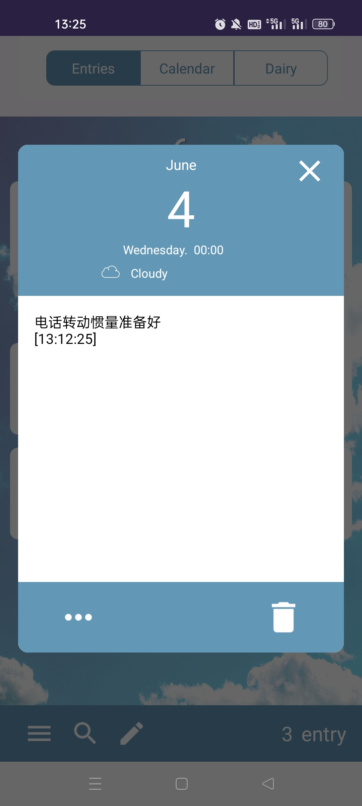
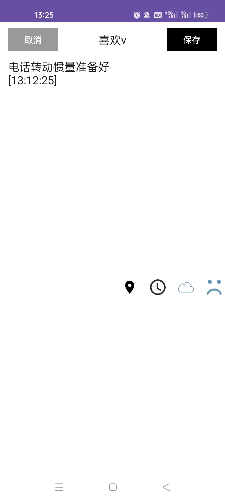
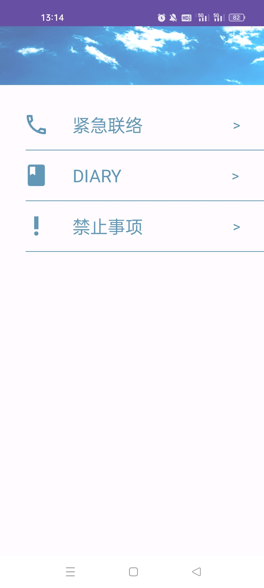
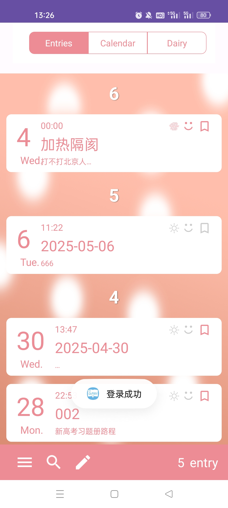

# 我的日记（Your Name Diary）

本项目是基于电影《你的名字》灵感开发的安卓日记应用

## 项目简介

- **项目名称**：我的日记（Your Name Diary）
- **平台**：Android
- **开发语言**：Java
- **数据库**：SQLite
- **主要依赖**：
  - MaterialCalendarView（日历控件）
  - Gson（数据序列化与备份）
  - AppCompat、AndroidX 等

## 主要功能

| 功能模块         | 说明                                                                                   |
|------------------|----------------------------------------------------------------------------------------|
| 用户登录/注册    | 支持用户注册、登录，自动记忆登录状态                                                   |
| 日记管理         | 新建、编辑、删除日记，每天仅可创建一篇，支持按月分组展示。日记可以加入定位、心情、天气、时间，设置标签                                |
| 日历视图         | 日历模式下以点标记有日记的日期，黄色/蓝色区分不同类型，支持点击某天快速编辑/新建日记    |
| 搜索功能         | 支持日记内容、标题的实时搜索，快速定位回忆                                              |
| 时光倒流         | 一键删除所有日记并可恢复，模拟电影中的“时光倒流”情节                                    |
| 数据备份/恢复    | 日记数据本地备份为 JSON 文件，支持一键恢复                                              |
| 个性化主题       | 根据用户性别自动切换主题色，界面元素动态适配                                            |
| 密码修改         | 支持用户修改登录密码，保障账户安全                                                      |
| 退出登录         | 一键安全退出，清除自动登录信息                                                          |

### 详细功能说明

#### 1. 用户系统
- 支持注册、登录，自动保存登录状态
- 用户信息本地存储，支持密码修改

#### 2. 日记管理
- 每天仅可创建一篇日记，防止重复
- 日记内容包括：标题、正文、时间、天气、心情、标签等
- 支持编辑、删除、分组展示

#### 3. 日历视图
- 日历控件高亮有日记的日期
- 黄色点表示特殊标签，蓝色点为普通日记
- 支持点击某天快速进入编辑/新建页面

#### 4. 搜索功能
- 实时搜索日记标题和内容
- 搜索结果高亮显示，支持一键清空

#### 5. 时光倒流
- 一键删除所有日记，并生成本地备份
- 可随时恢复所有日记，体验“时光倒流”情节

#### 6. 个性化主题
- 根据用户性别自动切换主色调
- 动态适配底部导航栏、Tab、按钮等界面元素

#### 6. 其他
- 禁止事项
- 紧急联络
## 技术实现

- **数据存储**：采用 SQLite 数据库，分为用户表、日记表、用户-日记关联表
- **日历装饰**：MaterialCalendarView + 自定义 Decorator 实现多色点标记
- **数据备份**：Gson 序列化日记数据为 JSON 文件，支持本地恢复
- **UI适配**：动态切换主题色，支持多种分辨率
- **动画与交互**：支持删除动画、遮罩层、软键盘自动弹出等细节优化

## 截图展示

### 登录注册界面

### 主界面

### 时光倒流

### 日记视图

### 设置界面

### 性别切换主题

---

## 图片来源

本项目部分图片资源来自 [大夏K-MyDiary](https://github.com/DaxiaK/MyDiary/)，特此致谢。

